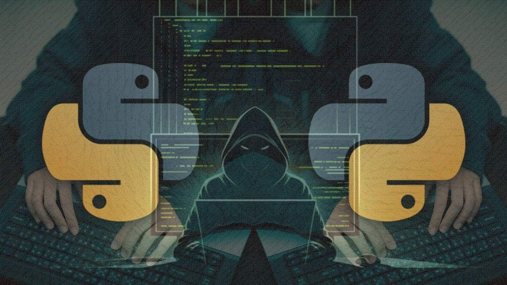

Udemy Course >> Python Ethical Hacking - Pentest for Hackers with Scripting

Network Administration & Server Infrastructure Security Pentest - Python for Ethical Hacking - Python for Cybersecurity and Hackers

Tips/Tricks/Notes/Commands URL Link: 
https://github.com/nimaxnimax/Udemy_Python

Instructor & Courses >> 
https://www.udemy.com/user/adrian-fischer-infotech/


**********

Install Python on Ubuntu

```bash
sudo apt update
sudo apt install python
python --version
sudo add-apt-repository ppa:deadsnakes/ppa
sudo apt update
sudo apt install python3.12
python3.12 --version
```

